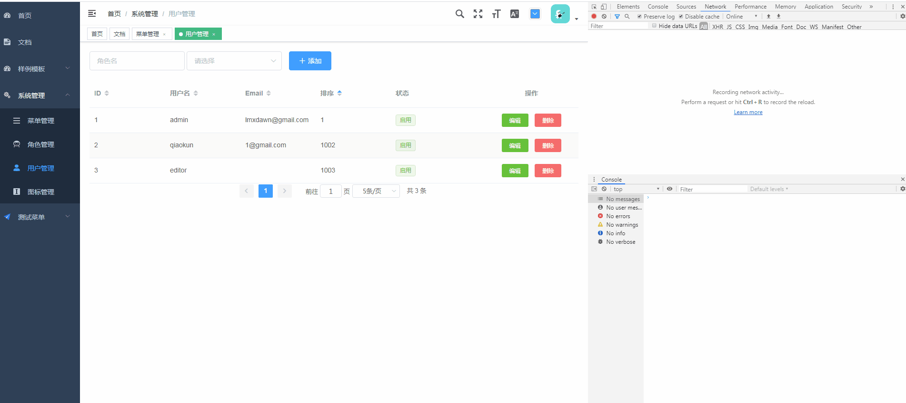

# vue-php-admin 项目说明

通用的角色权限管理模板，没有动态切换角色功能，动态切换角色见 [vue-php-admin-V3](https://github.com/emacle/vue-php-admin-V3.git)

基于 vue-element-admin 和 PHP CodeIgniter RESTful 实现，
采用前后端分离架构的权限管理系统，PHP快速开发平台，目标是搭建一
套简洁易用的快速解决方案，可以帮助用户有效降低项目开发难度和成本。

以vue-element-admin@3.10.0 前端模板为基础，修改动态路由部分，实现菜单路由
可根据后端角色进行动态加载. 后端路由权限基于 php-jwt 使用 hook 做token及权限认证

将vue-element-admin前端原来样例模板除首页、文档外，其余样例模板
归档集中在 **样例模板** 菜单下，见 @router/index.js constantRouterMap，
其余组件如 tags-views等，全部未做变化，可根据需要具体需求进行删减。 

## 功能介绍
1. 系统登录：系统用户登录，系统登录认证（jwt token方式success）, **github 三方登录(success)**
2. 用户管理：新建用户，修改用户，删除用户，查询用户
3. 角色管理：新建角色，修改角色，删除角色，查询角色
4. 菜单管理：新建菜单，修改菜单，删除菜单，查询菜单
5. 图标管理：vue-element-admin 原有封装组件
6. TODO: 图形验证码, 微信登录, 界面主题优化...
7. **使用jwt token 前后端实现 access_token过期后无痛无缝在刷新, refreshtoken 加入计数器,在有效期内接口调用超过一定次数自动续期, CI模式使用hooks做控制器方法调用前的token及权限认证功能** 

## 开发环境
- phpstudy  php 5.6.27 nts + Apache
- vue.js

## 后端开发框架 
 - 后端 [PHP CI 3.1.10 RESTful](https://github.com/chriskacerguis/codeigniter-restserver)
 - 前端 [vue-element-admin](https://github.com/PanJiaChen/vue-element-admin/)

## 使用说明

### 前端
1. 下载前端代码(vue-element-admin目录)解压
2. 修改接口配置

    cat config/dev.env.js
    ```html
        module.exports = {
          NODE_ENV: '"development"',
          ENV_CONFIG: '"dev"',
          // BASE_API: '"https://api-dev"' 根据后端实际接口配置
          BASE_API: '"http://www.cirest.com:8889/api/v2/"'
        }
    ```
3. 运行
    ```html
       npm run dev
    ```

### 后端
1. 下载PHP后端代码(CodeIgniter-3.1.10目录)解压
2. 创建数据库 vueadmin, 导入 **vueadmin.sql** 文件，navcat-for-mysql导入有时会出错时, 修改 mysql my.ini配置文件参数 mysqld 节点下添加 max_allowed_packet = 500M

3. 后端数据库连接配置 修改配置文件

    cat application\config\database.php
    
    ```php
     $db['default'] = array(
        'dsn'	=> '',
        'hostname' => 'localhost',
        'username' => 'root',
        'password' => 'root',
        'database' => 'vueadmin',
        ...
    ```
4. CodeIgniter-3.1.10目录 composer 安装相关依赖 php-jwt 与 codeigniter-restserver
    ```php
    composer install  // 根据composer.json 初始安装所有插件包
    或
    composer require firebase/php-jwt
    composer require chriskacerguis/codeigniter-restserver
    ```
5. 使用 phpstudy 配置站点域名管理, 同时修改hosts文件（可选）

    www.cirest.com:8889  **注意与前端接口配置一致** BASE_API: '"http://www.cirest.com:8889/api/v2/"'

    接口调用使用示例：
    ```html    
    http://www.cirest.com:8889/api/v2/sys/menu/testapi
    http://www.cirest.com:8889/index.php/api/v2/sys/menu/testapi
    
    ~~request header 配置 X-API-KEY: oocwo8cs88g4c8w8c08ow00ss844cc4osko0s0ks~~ 默认禁用API-KEY 可在CodeIgniter-3.1.10/config/rest.php中 $config['rest_enable_keys'] = TRUE 开启;
    
    ```
    带有 index.php 若要去掉 修改根目录下 CodeIgniter-3.1.10/.htaccess 文件(Apache), 注意不是 CodeIgniter-3.1.10/application/ 目录下
    Nginx的话需要对应的配置
    
    cat CodeIgniter-3.1.10/.htaccess
    
    ```html
      <IfModule mod_rewrite.c>
        RewriteEngine on
        RewriteCond %{REQUEST_FILENAME} !-d
        RewriteCond %{REQUEST_FILENAME} !-f
        RewriteRule ^(.*)$ /index.php?/$1 [QSA,PT,L]
      </IfModule>
    ```

## 编辑器
 - phpstrom
 - vscode

## jwt无缝刷新测试配置

CodeIgniter-3.1.10\application\config\config.php   // access_token/refresh_token 过期时间配置

```
$config['jwt_access_token_exp'] = 15; // 单位秒
$config['jwt_refresh_token_exp'] = 180; // 单位秒
```


## jwt无痛刷新效果
 
 
 

## github 三方认证demo.gif
 

## 截图
 
 
 
  
 
 
 
 
